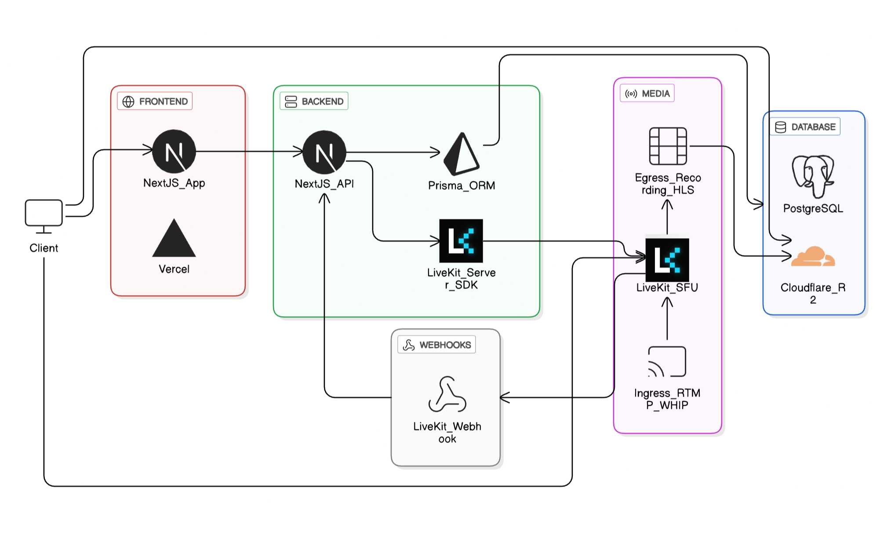

# Streamix

A modern, full-featured live streaming platform built with Next.js, React, and LiveKit. Streamix enables users to broadcast live video content, interact with viewers through chat, manage their streams, and grow their community.

## Features

### Core Functionality

- **Live Streaming**: Browser-based broadcasting and RTMP/WHIP support for OBS and other streaming software
- **Real-time Chat**: Interactive chat with moderation controls (followers-only mode, delayed messages)
- **User Authentication**: Secure JWT-based authentication system with session management
- **Follow System**: Follow and unfollow creators to build your community
- **Block System**: Block users to maintain a safe streaming environment
- **Stream Management**: Configure stream keys, thumbnails, and stream settings
- **Video on Demand (VOD)**: Watch recorded streams after they end
- **Search**: Discover streams and creators
- **Analytics**: Track your stream performance and viewer metrics

### Streaming Features

- **Browser Broadcast**: Stream directly from your browser without additional software
- **Screen Sharing**: Share your screen with viewers
- **Multi-Quality Streaming**: Automatic quality adjustment and manual quality selection
- **Live Reactions**: Real-time viewer reactions (hearts, thumbs up, party, fire, star, etc.)
- **Recording**: Record your streams for later viewing
- **Chat Controls**: Enable/disable chat, set follower-only mode, and delay messages
- **Restreaming**: Simultaneously stream to multiple platforms (YouTube, Twitch, Facebook Live)
- **OBS/RTMP Support**: Use professional streaming software with RTMP or WHIP protocols

## Tech Stack



## Prerequisites

Before you begin, ensure you have the following installed:

- **Node.js** 20 or higher
- **npm**, **yarn**, **pnpm**, or **bun**
- **PostgreSQL** database (local or hosted)
- **LiveKit Cloud** account or self-hosted LiveKit server

## 🔧 Installation

1. **Clone the repository**

   ```bash
   git clone https://github.com/trandongtruclam/streamix/
   ```

2. **Install dependencies**

   ```bash
   npm install
   # or
   yarn install
   # or
   pnpm install
   ```

3. **Set up environment variables**

   Copy the `.env.example` file and fill in your values:

   ```bash
   cp .env.example .env
   ```

   Then edit the `.env` file with your configuration:

4. **Set up the database**

   ```bash
   # Generate Prisma Client
   npx prisma generate

   # Run database migrations
   npx prisma migrate dev --name init

   # (Optional) Open Prisma Studio to manage your data
   npx prisma studio
   ```

5. **Configure LiveKit Webhooks**

   In your LiveKit dashboard, configure webhooks to point to:

   ```
   https://your-domain.com/api/webhooks/livekit
   ```

   The webhook handles:

   - Stream start/end events
   - Participant join/leave events
   - Track publish/unpublish events

6. **Run the development server**

   ```bash
   npm run dev
   # or
   yarn dev
   # or
   pnpm dev
   # or
   bun dev
   ```

7. **Open your browser**

   Navigate to [http://localhost:3000](http://localhost:3000)

## License

This project is a course project for Multimedia Communication Technology from UIT's coursework.
